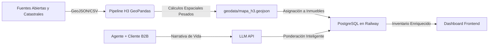

# 🏠 Geovivienda: Inteligencia Inmobiliaria de Próxima Generación

> **"En el mercado inmobiliario, el éxito no depende de vender metros cuadrados, sino de vender calidad de vida."**

## 🎯 Visión Ejecutiva: El Valor de Geovivienda para el Negocio

Geovivienda no es un portal de búsqueda de inmuebles más; es una **herramienta estratégica B2B (Business-to-Business)** diseñada para transformar el flujo de ventas de los agentes y ejecutivos de Geovivienda. 

En un mercado saturado donde el cliente toma meses en decidirse, la fricción principal es encontrar la coincidencia perfecta entre *lo que el cliente imagina* y *lo que realmente ofrece el entorno del inmueble*. Geovivienda soluciona esto combinando **Inteligencia Geoespacial (H3)** e **Inteligencia Artificial (LLM)**.

### ¿Cómo ayuda Geovivienda a cumplir los objetivos de negocio?

1. **Cierre de Ventas Más Rápido (Reducción de Tiempo en el Embudo)**: Al interpretar mediante IA las preguntas abiertas de los clientes (ej. *"busco un apartamento seguro, donde pueda salir a pasear a mis perros en la noche y tenga el MIO cerca"*), el sistema califica y filtra automáticamente el inventario. Los agentes pueden presentar opciones altamente relevantes en la primera cita, reduciendo las visitas físicas innecesarias.
2. **Ventaja Competitiva Basada en Datos (Data-Driven Real Estate)**: Mientras la competencia vende "un apartamento de 3 habitaciones", los agentes de Geovivienda venden "un apartamento rodeado de 4 parques, a 300 metros del transporte masivo y en una zona con índices de seguridad superiores al promedio".
3. **Escalabilidad y Ecosistema B2B**: Estamos desarrollando una sólida infraestructura espacial para otras ciudades de Colombia. Esto nos permite subir proyectos exclusivos de aliados estratégicos (constructoras, agencias) de manera ágil y conectar todo el flujo de leads calificados directamente con nuestro CRM en Zoho, automatizando el proceso de seguimiento comercial.
4. **Fidelización y Confianza del Cliente**: Un cliente que recibe opciones que realmente escuchan su estilo de vida es un cliente que confía ciegamente en su agente.

---

## 🚀 La Solución Tecnológica

### 1. Inteligencia Geoespacial Avanzada (Motor H3 de Uber)
Toda la ciudad está dividida en miles de hexágonos matemáticos (resolución 9), cada uno enriquecido con más de 100 variables pre-calculadas:
- **Movilidad**: Distancia exacta a estaciones de transporte masivo (Transmilenio, SITP, MIO, Metro) y redes de ciclorrutas.
- **Entorno Socioeconómico**: Promedios ponderados del estrato en radios de 200 y 500 metros.
- **Puntos de Interés (POIs)**: Cercanía a supermercados (D1, Ara), colegios, zonas verdes, hospitales y centros comerciales.
- **Seguridad**: Análisis histórico de micro-criminalidad (hurtos y delitos) por zona.

### 2. Scoring Inmobiliario Potenciado por IA (Gemini)
El sistema abandona los filtros rígidos. Utilizamos modelos de Inteligencia Artificial para:
- Leer la descripción narrativa de las necesidades del cliente.
- Extraer dinámicamente los pesos o importancia de cada variable (ej. qué tan importante es el transporte vs. las zonas verdes).
- Asignar un **Score de Compatibilidad (0 a 100)** a cada inmueble de la base de datos frente a ese cliente específico.

### 3. Dashboard Interactivo Premium
Una interfaz web enfocada en productividad, construida en Flask y Leaflet.js, que ofrece:
- **Flujos B2B**: Gestión de múltiples perfiles de clientes, guardado de búsquedas y seguimiento de prospectos.
- **Visualización GIS**: Capas vectoriales en tiempo real (estratos, rutas de transporte) superpuestas en el mapa interactivo.

---

## 🛠️ Stack Tecnológico Moderno

Para soportar esta visión, hemos migrado a una infraestructura de clase mundial:

| Capa | Tecnología | Rol Estratégico |
| :--- | :--- | :--- |
| **Backend & Core** | Python / Flask | Motor de orquestación ágil, APIs REST y algoritmos de negocio. |
| **Base de Datos** | PostgreSQL (Railway) | Persistencia robusta en la nube. Garantiza que el inventario, clientes y búsquedas estén siempre sincronizados y disponibles. |
| **Inteligencia Geoespacial** | Uber H3 / GeoPandas | Procesamiento de superposición masiva de polígonos y cálculo de distancias. |
| **Inteligencia Artificial** | Gemini API | Comprensión del lenguaje natural (NLP) para ponderación de requerimientos de clientes. |
| **Frontend & GIS** | Vanilla JS / Leaflet.js | Renderizado de mapas y experiencia de usuario asíncrona (AJAX) sin lag. |
| **Diseño UI/UX** | CSS3 / Glassmorphism | Estética corporativa de impacto que inspira confianza en los ejecutivos y clientes. |

---

## 🗺️ Arquitectura de Datos (Data Pipeline)

El flujo de información que alimenta a Geovivienda:



### La Dualidad Espacial: Optimización de Rendimiento
Para garantizar una experiencia veloz, hemos dividido los datos geográficos:
- **Capa Profunda (`geodata/`)**: Archivos pesados (crimen, UPZs, barrios, POIs) utilizados **solo por el servidor** para calcular la IA.
- **Capa Visual (`static/geo/`)**: GeoJSON optimizados (ligeros) que viajan al navegador del usuario **solo para dibujar** el mapa.

---

## ⚙️ Estructura de Componentes del Proyecto

```
Geovivienda/
├── app.py                   # Servidor central Flask
├── services/
│   ├── busqueda.py          # Lógica centralizada de inventario y filtrado
│   ├── scoring.py           # Algoritmo de ranking de compatibilidad Inmueble-Cliente
│   └── spatial_analysis.py  # Interfaz de consulta de capas y hexágonos H3 en memoria
├── database/
│   ├── db.py                # Conexión, pooling y queries a PostgreSQL
│   └── schema.sql           # Estructura relacional normalizada multi-ciudad
├── scripts/                 # Tareas automatizadas de generación H3 y scraping
├── geodata/                 # Almacén de procesamiento backend (Carpetas /bogota y /cali)
├── static/
│   ├── script.js            # Lógica AJAX interactiva y Mapas Leaflet
│   └── geo/                 # Recursos espaciales ligeros para Frontend (Carpetas /bogota y /cali)
├── templates/               # Vistas HTML con Jinja2
└── tests/                   # Framework Pytest: +40 pruebas de integración y unitarias para asegurar calidad
```

---

## 📈 Roadmap Ejecutivo y Proyección de Fases

| Fase | Estado | Hito Entregado |
|------|--------|----------------|
| **Fase 1: Infraestructura Core** | ✅ Completada | Adopción de PostgreSQL, estructura de autenticación de clientes y rediseño B2B del portal. |
| **Fase 2: Inteligencia (H3+AI)**| ✅ Completada | Despliegue del índice espacial H3 y conexión funcional con modelos de lenguaje LLM para scoring. |
| **Fase 3: Multi-Ciudad** | 🚧 En Progreso | Estandarización de taxonomía urbana (Sectores y Nivel Admin). Inicio del piloto comercial en la ciudad de Cali. |
| **Fase 4: Insights Predictivos** | 📅 Planificada | Módulo de sugerencias automáticas de inversión y predicción de plusvalía a 5 años basada en macro-tendencias. |
| **Fase 5: Apertura B2C** | 📅 Futuro | Lanzamiento de interfaz pública (Lead Generation) para captar clientes orgánicos, redirigiéndolos al agente de Geovivienda más cercano. |

---

*Geovivienda no se trata de buscar dónde vivir. Se trata de predecir cómo vas a vivir.*
